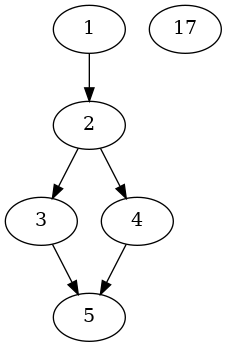

# JPP 2020/21 --- Program zaliczeniowy (Haskell)

## A. Zbiory

Na potrzeby tego zadania przez implementację zbiorów będziemy rozumieć moduł dostarczający typ `Set` oraz operacje:

``` haskell
empty     :: Set a
null      :: Set a -> Bool
member    :: Eq a => a -> Set a -> Bool
singleton :: a -> Set a
fromList  :: [a] -> Set a
toList    :: Set a -> [a]
toAscList :: Ord a => Set a -> [a] -- elementy w porządku rosnącym
union     :: Set a -> Set a -> Set a
insert    :: a -> Set a -> Set a
```

(NB to nie jest to samo co `Set` z modułu `Data.Set`)

tudzież instancje

``` haskell
instance Ord a => Eq (Set a) where

instance Semigroup (Set a) where

instance Monoid (Set a) where

instance Show a => Show (Set a) where

instance Functor Set where
```

Uzupełnij potrzebne operacje i instancje dla implementacji zbiorów przy pomocy typu

``` haskell
data Set a = Empty
           | Singleton a
           | Union (Set a) (Set a)
```

tak, by spełnione były warunki

``` haskell
leftUnit :: Set Int -> Bool
leftUnit a = mempty <> a == a

rightUnit :: Set Int -> Bool
rightUnit a = a <> empty == a

unionCommutative :: Set Int -> Set Int -> Bool
unionCommutative a b = a <> b == b <> a

unionIdempotent :: Set Int -> Set Int -> Bool
unionIdempotent a b = a <> a == a

assoc :: Set Int -> Set Int -> Set Int -> Bool
assoc x y z = (x<>y)<>z == x<>(y<>z)
```

(NB, implementacja musi być "uczciwa" - implementacje, w których kazdy zbiór jest pusty i temu podobne,
 nie bedą akceptowane)


## B. Grafy

Przez implementację grafów (skierowanych) będziemy rozumieć konstruktor typu wraz z instancją klasy

```
class Graph g where
  empty   :: g a               -- graf pusty
  vertex  :: a -> g a          -- pojedynczy wierzchołek, 0 krawędzi
  union   :: g a -> g a -> g a -- suma teoriomnogościowa
  connect :: g a -> g a -> g a
```

Operacja `union` daje graf, którego zbiory wierzchołków i krawędzi są sumami odpowiednich zbiorów jej argumentów.

Operacja `connect` dla grafów $(V_1,E_1)$ i $(V_2, E_2)$ daje graf
$$ (V_1, E_1) \to (V_2, E_2) = (V_1 \cup V_2, E_1 \cup E_2 \cup V_1 \times V_2) $$

Rozważmy dwie reprezentacje grafów - przy użyciu relacji i algebraiczną:

``` haskell
data Relation a = Relation { domain :: Set a, relation :: Set (a, a) }
    deriving (Eq, Show)

data Basic a = Empty
             | Vertex a
             | Union (Basic a) (Basic a)
             | Connect (Basic a) (Basic a)
```

Uzupełnij implementacje

``` haskell
instance Graph Relation where
instance Graph Basic where
instance Ord a => Eq (Basic a) where
instance Functor Basic

fromBasic :: Graph g => Basic a -> g a
```

Funkcja `fromBasic` ma dawać graf izomorficzny ze swoim argumentem.

Ponadto spełnione muszą być własności

``` haskell
leftUnit :: Basic Int -> Bool
leftUnit a = empty * a == a

rightUnit :: Basic Int -> Bool
rightUnit a = a * empty == a

connectAssociative :: Basic Int -> Basic Int -> Basic Int -> Bool
connectAssociative x y z = (x * y) * z == x * (y * z)

unionCommutative :: Basic Int -> Basic Int -> Bool
unionCommutative a b = a + b == b + a

unionAssociative :: Basic Int -> Basic Int -> Basic Int -> Bool
unionAssociative x y z = (x + y) + z == x + (y + z)

unionIdempotent :: Basic Int -> Basic Int -> Bool
unionIdempotent a b = a + a == a

distributive :: Basic Int -> Basic Int -> Basic Int -> Bool
distributive x y z = x*(y+z) == x*y + x*z

decomposable :: Basic Int -> Basic Int -> Basic Int -> Bool
decomposable x y z = x*y*z == x*y + x*z + y*z
```

gdzie

``` haskell
instance (Ord a, Num a) => Num (Basic a) where
    fromInteger = vertex . fromInteger
    (+)         = union
    (*)         = connect
    signum      = const empty
    abs         = id
    negate      = id
```

tudzież analogiczne własności dla `Relation`.

Stwórz instancję `(Ord a, Show a) => Show (Basic a)` tak aby

```
example34 :: Basic Int
example34 = 1*2 + 2*(3+4) + (3+4)*5 + 17

-- >>> show example34
-- "edges [(1,2),(2,3),(2,4),(3,5),(4,5)] + vertices [17]"
```

Napisz funkcję

``` haskell
mergeV :: Eq a => a -> a -> a -> Basic a -> Basic a
```

taką, że `mergeV a b c g` daje graf `g` zmodyfikowany w ten sposób, że wierzchołki
`a` i `b` są sklejone w wierzchołek oznaczony `c`,
a krawędzie które w g prowadzą z/do wierzchołków `a` i `b` prowadzą z/do `c`, np.

```
-- >>> mergeV 3 4 34 example34
-- edges [(1,2),(2,34),(34,5)] + vertices [17]
```

## C. Wizualizacja

Użytecznym narzedziem do wizualizacji grafów jest GraphViz (graphviz.org); na students i Ubuntu dotepny jako program `dot`).

Napisz funkcję reprezentujaca graf w formacie GraphViz

``` haskell
todot :: (Ord a, Show a) => Basic a -> String
```

na przykład

```
> putStrLn $ todot example34
digraph {
1 -> 2;
2 -> 3;
2 -> 4;
3 -> 5;
4 -> 5;
17;
}
```

NB tu wykorzystamy tylko ułamek możliwosci GraphViZ; wystarczy

`digraph { krawędzie wierzchołki}`.

Jeśli zapiszemy taką reprezentację w pliku `example34.dot` i uruchomimy

```
dot -Tpng example34.dot -o example34.png
```

otrzymamy plik `example34.png` jak na załączonym obrazku.




\clearpage

## D. Applicative/Monad

Uzupełnij instancje

``` haskell
instance Applicative Basic where
instance Monad Basic where
```

korzystajac z jednej z powyższych instancji, napisz funkcję

``` haskell
splitV :: Eq a => a -> a -> a -> Basic a -> Basic a
```

taką, że `splitV a b c g` daje wariant grafu `g`, w którym zamiast wierzchołka `a` wystepują jego dwie kopie `b` oraz `c`, a krawędziom prowadzącym z/do `a` odpowiadają krawedzie prowadzące do `b` i `c`, n.p.

``` haskell
-- >>> splitV 34 3 4 (mergeV 3 4 34 example34)
-- edges [(1,2),(2,3),(2,4),(3,5),(4,5)] + vertices [17]
```

## Wymagania Techniczne

1. Należy oddać pliki `Set.hs` i `Graph.hs` powstałe przez uzupełnienie odpowiednich szablonów (`*-template.hs`)
2. Można importować:
    - stworzony przez siebie moduł `Set`
    - uzupełniony moduł `Set`
    - moduły ze standardowego pakietu `base`
3. Do dostarczonych szablonów modułów można dodawać własne funkcje.
Nie można natomiast usuwać, ani zmieniać znajdujących się w nich elementów,
w szczególności komentarzy zawierających testy.
4. rozwiązania skrajnie nieefektywne będą karane; przy porządnym rozwiązaniu testy (TestAll) przechodzą w ok 2s. Rozwiązanie, gdzie będzie to trwało ponad minutę uznamy za nieefektywne.

## Ocenianie

Zadanie będzie oceniane nie tylko pod kątem poprawności,
ale również czytelności kodu i wykorzystania poznanych mechanizmów języka.

Zadanie MUSI być rozwiązane samodzielnie. Wszelkie zapożyczenia muszą być wyraźnie zaznaczone z podaniem źródła.

Zabronione jest oglądanie cudzych rozwiązań, jak również wszelkie formy udostępniania
własnego rozwiązania innym osobom.

Rozwiązania niesamodzielne będą oceniane na 0p.
W wypadku stwierdzenia istotnego podobieństwa dwóch (lub większej liczby)
rozwiązań, wszystkie będą oceniane na 0p. Dlatego należy zadbać o utrzymanie
prywatności swojego kodu.

### Rozwiązania częściowe

Warunkiem uzyskania punktów za rozwiązanie częściowe
(nie obejmujące całego zakresu zadania,
bądź nie przechodzące wszystkich wymaganych testów)
jest wyraźne opisanie zrealizowanego zakresu w komentarzu na początku oddawanego pliku.

Rozwiązaniom częściowym przyznana zostanie znacznie mniejsza liczba punktów
niż rozwiązaniom pełnym (zasadniczo **najwyżej** 50%).
Wyjątkiem są rozwiązania, w których brakuje tylko części D (wtedy mozna liczyć na maks. 80%).
